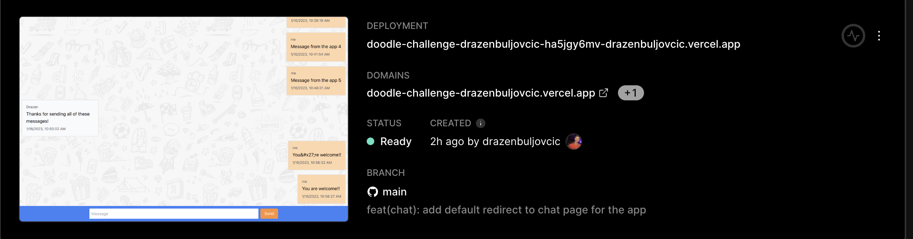

## Doodle Challenge

> Dražen Buljovčić

This is a coding assesment challenge sent to me to implement a small app based on the [assignment](https://github.com/DoodleScheduling/hiring-challenges/tree/master/frontend-engineer).

### App

This is a [Next.js app](https://nextjs.org/docs/getting-started) that utilizes SSR to present all components to the user immediately on page load.



> SSR can be previewed directly on the Vercel dashboard.

The app is deployed and is accessible [here](https://doodle-challenge-drazenbuljovcic.vercel.app/chat)!

### Workflow

#### Development

Please check [package.json](package.json) for all available scripts to manage the application development.

Run in your terminal and the app will open by default on [http://localhost:3000](http://localhost:3000).

_Change port number if the default one already has a process running_

```
$ yarn dev
```

The whole app code is written with `Typescript`.

`Testing`

This project supports testing with Jest.

`TODOs`

For testing component behaviour we would introduce `React-Testing-Library`.
For testing e2e behaviour of the app we could add a tool like `Cypress`.

```
$ yarn test
```

`Linting`

```
$ yarn lint
```

`Prettier`

```
$ yarn prettier
```

#### Review

On opening each feature PR there is an automatic link set up with preview deployments.

Check [example PR](https://github.com/drazenbuljovcic/doodle-challenge/pull/1) to find a link to the preview and open the app with the current changes applied before being merged to prod.

`TODO CI/CD`

#### Deployment

Run the build script to generate the artifacts in the state ready for deployment to either test environments or to production.

```
$ yarn build
```

`PRODUCTION`

On push to the `main` branch - or merging the PR into `main` we will get an automatic production deployment.

### Next steps for this application

As we are using Next.js v13 we would be able to convert this application to utilize the `app` [directory](https://nextjs.org/blog/layouts-rfc).
